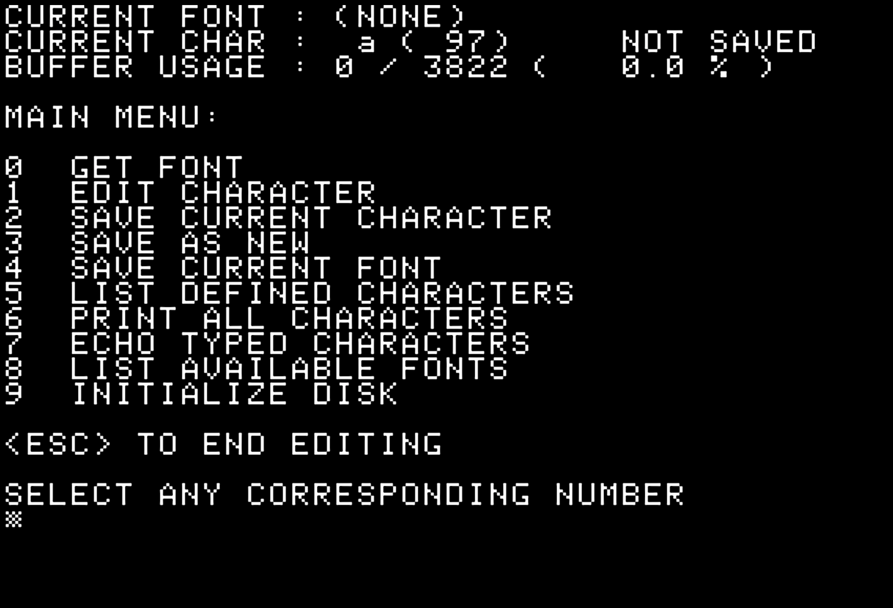
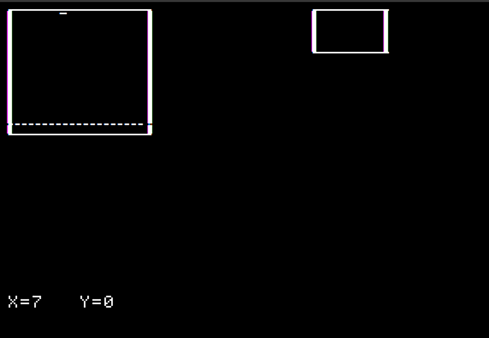

# AppleII-CharacterSet
A character set (font) editor and loader for the Apple II in Forth

I got this from Lloyd Prentice of Prentice Associates, Inc, a company that developed a lot of Apple II software in Forth. I don't know if Prentice created this software. If so, Lloyd releases it with the MIT license. But it may not be his to release.

To use editor, boot the editor disk then type START

To use the loader, *shrug* integrate into your Apple II Forth program, I guess.

